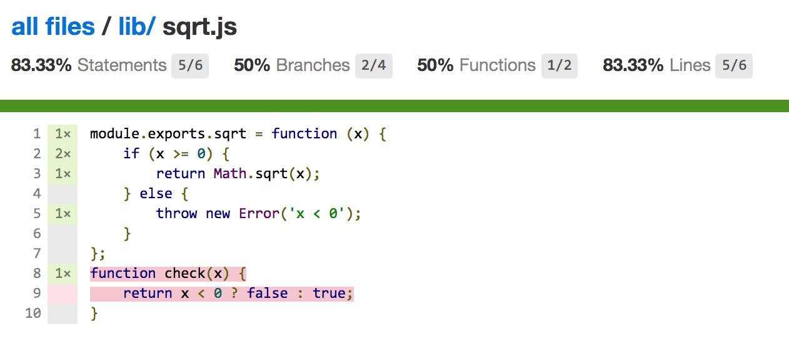

# Chap02. 架設自己的開發環境

## Node的編譯與安裝

使用Node開發程式，經常下載使用協力廠商模組。有些模組包含C++程式，使用npm指令安裝的時候會編譯這些C++檔案。此時如果作業系統的GCC版本過低，則編譯C++模組會出錯。而編譯新版本的GCC非常耗時，並且步驟繁瑣，這種情況下，建議使用**容器**執行Node程式。

## 開發與偵錯

在VSCode IDE對*test/test.js*專案進行偵錯(F5)：

```sh
/usr/local/bin/node --debug-brk=3861 --nolazy ch02/test/test.js
```

這個字串是啟動偵錯服務端的命令列。

- `--debug-brk`：表示啟動偵錯服務端後，在用戶端連接之前，不執行指令稿。此時，如果stopOnEntry為true，則用戶端連接成功之後，仍然不執行指令稿，否則開始執行，直到遇到中斷點。
- `3861`：代表用戶端連接的通訊埠編號，隨機分配。Node程式的偵錯過程符合用戶端——伺服器模型，兩者使用TCP通訊，因此也支援遠端偵錯。
- `--nolazy`：這個選項指定V8採取非延遲編譯的方式產生可執行的機器碼。

launch.json檔案中的configurations鍵包含的三種偵錯方式各有各的適用場景。

```json
[{
        "name": "启动",
        "type": "Node",
        "request": "launch",
        "program": "${workspaceRoot}/app.js",
        "stopOnEntry": false,
        "args": [],
        "cwd": "${workspaceRoot}",
        "preLaunchTask": null,
        "runtimeExecutable": null,
        "runtimeArgs": [
            "--nolazy"
        ],
        "env": {
            "NODE_ENV": "development"
        },
        "externalConsole": false,
        "sourceMaps": false,
        "outDir": null
    },
    {
        "name": "附加",
        "type": "Node",
        "request": "attach",
        "port": 5858,
        "address": "localhost",
        "restart": false,
        "sourceMaps": false,
        "outDir": null,
        "localRoot": "${workspaceRoot}",
        "remoteRoot": null
    },
    {
        "name": "Attach to Process",
        "type": "Node",
        "request": "attach",
        "processId": "${command.PickProcess}",
        "port": 5858,
        "sourceMaps": false,
        "outDir": null
    }
]
```

1. 第一種方式偵錯工具，VS Code自動啟動一個偵錯服務端，執行我們指定的入口檔案。這種適合開發過程中，想要追蹤程式執行，或檢視執行時期的變數值的狀況，以確定程式執行是否符合預期。
2. 第二種主要用於遠端偵錯，需要遠端偵錯服務端事先執行起來。例如：

    ```sh
    node --debug[=port] yourfile.js
    ```
    
    然後為本機的用戶端指定port和address參數連接遠端的偵錯服務處理程序。但第二種方式只能用在Node 5.0級以上版本，對於低於5.0的版本，address參數應該使用default localhost。如果一定要遠端偵錯，就需要在服務端執行一個TCP代理，用於轉發用戶端的偵錯指令和傳回資訊。
    
3. 第三種是附加到處理程序的方式，這個方式的特點是起初Node程式並非以偵錯的方式執行。因此這個方式適合在程式執行一段時間遇到問題，開發者可以用中斷點在某些地方讓程式暫停，以便檢視內部狀態，定位問題。退出偵錯後，程式還可繼續執行。

## 單元測試

錯誤發現的早，帶來的風險和成本就愈低。**如果說寫是在往前衝，那測就是停下來安靜一會兒**。Node中每一個檔案皆是模組，可酌情選取，撰寫對應的測試檔案。

### Mocha測試架構

Mocha是一個用於前端和Node的JavaScript的測試架構。它集合了豐富的特性，讓非同步測試變得簡單有趣。Mocha依次串列執行我們撰寫的每一個測試使用案例，再將未捕捉例外與相關的使用案例對應起來的同時，產生靈活準確的測試報告。Mocha支援TDD和BDD兩種測試風格。

>**Tips**：  
>TDD(Test-Driven Development)即測試驅動開發，測試驅動開發的流程如下：  
>1. 撰寫測試程式  
>2. 執行測試檔案，跑一遍其中的測試使用案例。此時無一例外會全部失敗，因為要測試的物件還沒有  
>3. 實現被測物件  
>4. 重新執行測試檔案，修改問題，最後全部通過。  
>
>TDD是一種程式設計技術，它啟動程式設計師思考自己的程式是如何被其他程式所使用的。首先要寫一個測試來描述如何使用下一塊程式，然後實現這塊程式，並保障它通過測試。TDD的表述方式類似說明書，旨在闡明你希望程式如何表現。
>
>BDD(Behavior-Driven Development)及行為驅動開發。在TDD中，根據設計所撰寫的測試即使完全通過，也不能保障就是使用者想要的功能。BDD的作用是把利益關係人、發佈團隊等不同方面的專案相關人員集中到一起，形成共同的了解、共同的價值觀以及共同的期望值，它要求開發者在整個專案的層面上思考問題。 BDD關注整體行為是否符合預期，更接近人的思考方式，其表述方式更接近自然語言。

執行

```sh
yarn add mocha -g
```

```sh
mocha -help
```

*test/test1.js*：

```js
var assert = require('assert');
describe('Array', function () {
    describe('#indexOf()', function () {
        it('should return -1 when value is not present', function () {
            assert.equal(-1, [1, 2, 3].indexOf(4));
        });
    });
});
```

回到根目錄下，執行Mocha：

```sh
$ mocha      


  Array
    #indexOf()
      ✓ should return -1 when value is not present


  1 passing (7ms)


```

上述測試檔案第一行參考了assert模組，此模組是Node的原生模組，實現了斷言的功能。斷言是程式中的一種敘述，其作用是宣告預期的結果必須滿足。如果執行時期不成立，則拋例外。用程式敘述表達如下：

```js
if (測試條件滿足)
  ;
else
  throw new Error('AssertionError');
```

assert模組定義了一系列的方法，以下的實例列舉了這些方法的使用。

```js
var testarr1 = [1, 2, '3'];
var testarr2 = [1, 2, 3];
var testarr3 = [1, 2, 4];

assert.ok([]); //斷言為真
assert.equal(1, '1'); // 斷言相等
assert.notEqual(1, 2); // 斷言不相等
assert.strictEqual(1, 1); // 斷言嚴格相等
assert.notStrictEqual(1, '1'); // 斷言嚴格不相等
assert.deepEqual(testarr1, testarr2); // 斷言深度相等
assert.notDeepEqual(testarr1, testarr3); // 斷言深度不相等
assert.throws(function (err) {
    throw new Error('throw err intentionally');
}); // 斷言程式區塊拋出例外
assert.doesNotThrow(function (err) {

}); // 斷言程式區塊不泡例外
assert.ifError(false); // 斷言值為假——false, null, undefined, 0, '', NaN
```

除了內建的斷言模組，Mocha測試使用案例中還可以使用協力廠商的斷言函數庫，例如should.js。關於此模組的使用，有興趣可參考：[https://github.com/shouldjs/should.js/](https://github.com/shouldjs/should.js/)。

### TDD風格

在TDD風格下，可用的介面包含suite()、test()、suiteSetup()、suiteTeardown()、setup()和 teardown()函數，使用案例寫法如下：

```js
var assert = require('assert');

suite('Array', function () {
    setup(function (done) {
        setTimeout(function () {
            done();
        }, 1000);
    });
    suite('#indexOf()', function () {
        test('should return -1 when not present', function () {
            assert.equal(-1, [1, 2, 3].indexOf(4));
        });
    });
});
```

TDD使用suite和test組織測試使用案例，suite可以多級巢狀結構。setup在進入suite之後觸發執行，執行完全部使用案例後，teardown被觸發執行。使用Mocha測試非同步程式，只需要在使用案例函數裡面加一個參數done，非同步過程執行完畢之後，呼叫done()，通知Mocha繼續執行下一個測試使用案例。讀者需要知道，非同步過程的逾時預設為2秒，超過2秒就代表執行失敗了。也可以修改這個時間：

```js
setup(function (done) {
    this.timeout(3000)
    setTimeout(function () {
        done();
    }, 2100);
});
```

Mocha預設識別BDD風格的測試程式，因此需要增加`--ui tdd`參數執行上面的實例。

### BDD風格

BDD的介面有describe()、it()。同時支援4個鉤子函數before()、after()、beforeEach()、afterEach()。

describe()和it()還有別名，分別是context()和specify()。before()和after()分別在進入和退出describe()的時候被觸發。beforeEach()和afterEach()在執行每一個測試使用案例的前後被觸發。

下面是BDD風格的實例：

```js
var assert = require('assert');
var fs = require('fs');

describe('Array', function () {
    describe('#indexOf()', function () {
        it('should return -1 when the value is not present', function () {
            assert.equal([1, 2, 3].indexOf(5), -1);
            assert.notEqual([1, 2, 3].indexOf(1), -1);
        })
    })
});
describe('fs', function () {
    describe('#readdir', function () {
        it('should not return error', function (done) {
            fs.readdir(__dirname, function (err) {
                assert.ifError(err);
                done();
            });
        });
    });
});
```

可見，僅從用法上，BDD與TDD非常一致。

Mocha會自動讀取test目錄中檔案名稱為*mocha.opts*的內容，這個檔案的每一行代表一個設定，例如下例：

```
--require should
--reporter dot
--ui tdd
```

上面的設定就會讓Mocha引用should模組，報告樣式設定為dot，並且使用tdd的測試介面。執行mocha指令，指定的設定參數與這個設定黨中的設定若有衝突，以指令中的為準。

### 產生不同形式的測試報告

--reporter設定項目指定了測試報告的樣式，預設為spec，代表一個巢狀結構的分級視圖。Mocha提供了一些其他有趣或有用的視圖。舉例：

```sh
$ mocha --reporter landing --ui tdd              

  -------------------------------------------------------------------------------------------------------------------------------------------------
  ⋅⋅⋅⋅⋅⋅⋅⋅⋅⋅⋅⋅⋅⋅⋅⋅⋅⋅⋅⋅⋅⋅⋅⋅⋅⋅⋅⋅⋅⋅⋅⋅⋅⋅⋅⋅⋅⋅⋅⋅⋅⋅⋅⋅⋅⋅⋅⋅⋅⋅⋅⋅⋅⋅⋅⋅⋅⋅⋅⋅⋅⋅⋅⋅⋅⋅⋅⋅⋅⋅⋅⋅⋅⋅⋅⋅⋅⋅⋅⋅⋅⋅⋅⋅⋅⋅⋅⋅⋅⋅⋅⋅⋅⋅⋅⋅⋅⋅⋅⋅⋅⋅⋅⋅⋅⋅⋅⋅⋅⋅⋅⋅⋅⋅⋅⋅⋅⋅⋅⋅⋅⋅⋅⋅⋅⋅⋅⋅⋅⋅⋅⋅⋅⋅⋅⋅⋅⋅⋅⋅⋅⋅⋅⋅⋅✈
  -------------------------------------------------------------------------------------------------------------------------------------------------

  5 passing (2s)


```

看到的是一個起跑的飛機。

還可把測試報告匯入到檔案，例如以markdown格式儲存。

```sh
$ mocha --reporter markdown --ui tdd > test.md
```

### 程式覆蓋率工具Istanbul

Istanbul(伊斯坦堡)是土耳其名城，土耳其盛產地毯，地毯用於覆蓋，這個名稱由來於此。其實地毯(blanket)是另外一個類似工具的名字。Istanbl由雅虎出品。它容易使用，能夠產生漂亮的HTML報告，
結果直觀，檢視方便。值得一提的是，它也支援瀏覽器端的測試

```sh
yarn global add istanbul
```

安裝成功後，執行istanbul help可檢視它的說明資訊。下面舉例說明它的使用方法。

*lib/sqrt.js*：

```js
module.exports.sqrt = function (x) {
    if (x >= 0) {
        return Math.sqrt(x);
    } else {
        throw new Error('x < 0');
    }
};
function check(x) {
    return x < 0 ? false : true;
}
```

*test/sqrt_test.js*：

```js
'use strict';

let assert = require('assert');
let sqrt = require('./../lib/sqrt').sqrt;

describe('#sqrt()', function () {
    it('#sqrt(4) should equal 2', function () {
        assert.equal(sqrt(4), 2);
    });
    it('#sqrt(-1) should throw an Error', function () {
        assert.throws(function () {
            sqrt(-1);
        });
    });
});
```

*.istanbul.yml*，這個檔案的內容是Istanbul的設定項目。例如excludes:['sitelists/*']表示將忽略sitelists目錄的內容：

```
verbose: false
instrumentation:
    root: .
    default-excludes: true
    excludes: []
    include-all-sources: true
reporting:
    print: summary
    reports:
        - lcov
    dir: ./coverage
```

之後執行以下指令：

```sh
$ istanbul cover _mocha test/sqrt_test.js 


  #sqrt()
    ✓ #sqrt(4) should equal 2
    ✓ #sqrt(-1) should throw an Error


  2 passing (19ms)

=============================================================================
Writing coverage object [/Users/eden90267/Desktop/node/node-advanced/ch02/coverage/coverage.json]
Writing coverage reports at [/Users/eden90267/Desktop/node/node-advanced/ch02/coverage]
=============================================================================

=============================== Coverage summary ===============================
Statements   : 83.33% ( 5/6 )
Branches     : 50% ( 2/4 )
Functions    : 50% ( 1/2 )
Lines        : 83.33% ( 5/6 )
================================================================================

```

執行時期如果顯示出錯，建立_mocha的軟連結即可。_mocha代表在相同處理程序(即Istanbul所在的處理程序)執行測試使用案例。Istanbul會在*coverage/lcov-report*目錄下產生HTML格式的報告。



因為沒有呼叫check函數，因此函數的覆蓋率是50%。此外，它的統計結果還包含行覆蓋率、敘述覆蓋率和分支覆蓋率。

Istanbul提供了Hook機制，能夠在執行時向原始檔案植入程式。這使得使用者能測試檔案內部的非匯出函數。例如下面的實例：

```js
'use strict';

let assert = require('assert');
let istanbul = require('istanbul');
let hook = istanbul.hook,
    sqrtMatcher = function (file) {
        return file.match(/sqrt/);
    },
    sqrtTransformer = function (code, file) {
        return code + '\n module.exports.check = function(x) { return check(x); }';
    };
hook.hookRequire(sqrtMatcher, sqrtTransformer);
let sqrt = require('./../lib/sqrt').sqrt;
let check = require('./../lib/sqrt').check;

describe('#sqrt()', function () {
    it('#sqrt(4) should equal 2', function () {
        assert.equal(sqrt(4), 2);
    });
    it('#sqrt(-1) should throw an Error', function () {
        assert.throws(function () {
            sqrt(-1);
        });
    });
});
// 測試非匯出函數check
describe('#check()', function () {
    it('should be false when < 0', function () {
        assert.ifError(check(-1));
    });
});
```

istanbul模組Hook住了require函數。如果參考的模組名稱包含sqrt，則向讀出的原始檔案加一行字串，這行字串的作用是將內部的check函數匯出。執行以下指令：

```sh
$ istanbul cover _mocha test/sqrt_test.js


  #sqrt()
    ✓ #sqrt(4) should equal 2
    ✓ #sqrt(-1) should throw an Error

  #check()
    ✓ should be false when < 0


  3 passing (14ms)

No coverage information was collected, exit without writing coverage information

```